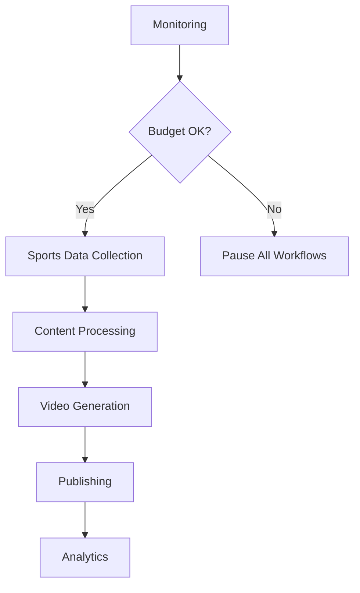

# Make.com Workflow Documentation

Complete guide for setting up Make.com scenarios for automated sports news video generation.

## 🎯 Overview

This system uses Make.com to orchestrate the entire video generation pipeline:
1. **Data Collection**: Fetch sports news from multiple APIs
2. **Content Processing**: Filter and format content for video creation
3. **Video Generation**: Send processed content to Fliki AI
4. **Quality Control**: Review and approve generated videos
5. **Publishing**: Upload approved videos to YouTube
6. **Monitoring**: Track costs and performance metrics

## 📋 Required Make.com Account

- **Minimum**: Premium Plan ($29/month)
- **Recommended**: Pro Plan ($99/month) for higher operation limits
- **Enterprise**: For 20+ videos/day with custom limits

## 🔧 Core Scenarios

### 1. Sports Data Collection Scenario
**File**: `../../config/make-scenarios/sports-data-collection.json`

**Modules**:
- **HTTP Request**: Fetch latest sports news from API-Sports
- **HTTP Request**: Fetch data from TheSportsDB
- **Data Store**: Cache results to avoid duplicate processing
- **Filter**: Remove old or irrelevant stories
- **Router**: Split data by sport type (NFL, NBA, MLB, etc.)

**Trigger**: Scheduled every 2 hours (12 runs/day)
**Operations**: ~50-100 per run

### 2. Content Processing Scenario
**File**: `../../config/make-scenarios/content-processing.json`

**Modules**:
- **Webhook**: Receive sports data from collection scenario
- **Text Processing**: Generate video scripts using OpenAI/ChatGPT
- **Image Search**: Find relevant sports images
- **Content Validation**: Check for duplicate content
- **Queue Management**: Manage video generation queue

**Trigger**: Webhook from data collection
**Operations**: ~30-60 per story

### 3. Video Generation Scenario
**File**: `../../config/make-scenarios/video-generation.json`

**Modules**:
- **Fliki AI API**: Generate videos from processed content
- **Webhook**: Monitor video generation status
- **File Storage**: Store generated video files
- **Quality Check**: Validate video output
- **Notification**: Alert on completion or errors

**Trigger**: Webhook from content processing
**Operations**: ~10-20 per video

### 4. Publishing Scenario
**File**: `../../config/make-scenarios/publishing.json`

**Modules**:
- **YouTube API**: Upload videos to channel
- **Metadata Setup**: Add titles, descriptions, tags
- **Thumbnail Upload**: Set custom thumbnails
- **Scheduling**: Schedule video publishing times
- **Analytics Tracking**: Record published video metrics

**Trigger**: Manual approval or automated based on quality score
**Operations**: ~5-15 per video

### 5. Monitoring & Control Scenario
**File**: `../../config/make-scenarios/monitoring.json`

**Modules**:
- **Data Store**: Track daily operations and costs
- **Cost Calculator**: Calculate current day spend
- **Conditional Logic**: Pause workflows if budget exceeded
- **Webhook**: Send pause/resume commands
- **Email/SMS**: Send alerts to administrators

**Trigger**: Scheduled every hour
**Operations**: ~5-10 per run

## 🔄 Workflow Integration

## ⚙️ Setup Instructions

### 1. Import Scenarios
1. Download scenario files from `../../config/make-scenarios/`
2. In Make.com dashboard, click "Create a new scenario"
3. Click "Import Blueprint" 
4. Upload the JSON file
5. Configure API connections and variables

### 2. Configure Connections
- **API-Sports**: Add API key and configure endpoints
- **Fliki AI**: Set up API authentication
- **YouTube API**: Configure OAuth2 credentials
- **OpenAI**: Add API key for content generation
- **Email/SMS**: Configure notification services

### 3. Set Variables
- `DAILY_BUDGET_LIMIT`: Maximum daily spend ($50-200)
- `VIDEO_QUOTA_DAILY`: Target videos per day (10-20)
- `SPORTS_CATEGORIES`: Enabled sport types
- `CHANNEL_ID`: Target YouTube channel
- `FLIKI_VOICE_ID`: Preferred AI voice

### 4. Test Scenarios
1. Start with data collection scenario
2. Run content processing with sample data
3. Test video generation with single item
4. Verify publishing workflow
5. Validate monitoring and alerts

## 📊 Operation Limits & Costs

### Make.com Operations
- **Data Collection**: ~600 ops/day
- **Content Processing**: ~800 ops/day  
- **Video Generation**: ~400 ops/day
- **Publishing**: ~200 ops/day
- **Monitoring**: ~120 ops/day
- **Total**: ~2,120 ops/day

### Recommended Plan
- **Pro Plan**: 10,000 ops/month = ~333 ops/day ⚠️ **Insufficient**
- **Enterprise**: Custom limits recommended for this volume

## 🚨 Error Handling

### Common Issues
1. **API Rate Limits**: Implement delays and retry logic
2. **Fliki AI Failures**: Queue items for retry
3. **YouTube Upload Errors**: Store videos for manual review
4. **Budget Overruns**: Immediate workflow pause

### Recovery Procedures
- Automatic retry with exponential backoff
- Manual intervention webhooks
- Error notification system
- Rollback capabilities

## 📈 Scaling Considerations

### Growth Path
1. **Phase 1**: 10 videos/day - Pro Plan
2. **Phase 2**: 20 videos/day - Enterprise Plan
3. **Phase 3**: Multiple channels - Custom architecture

### Performance Optimization
- Parallel processing where possible
- Efficient data caching
- Smart content filtering
- Batch operations

---

**Next Steps**: [API Integration Setup](../api-integrations/README.md)